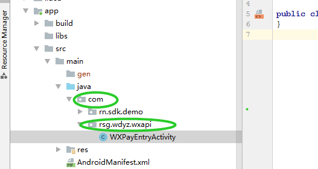

# 1.4 配置微信支付（必须）

\(1\) 在当前游戏工程项目中创建Java包结构：{游戏应用的包名}.wxapi 假设游戏自身的包名为: `com.rsg.wdyz` 则研发方需创建包结构`com.rsg.wdyz.wxapi`（如下图所示）:



\(2\)在上面创建的包中创建Java 类，其类名必须是：`WXPayEntryActivity`，其必须继承 `RNSDKWXPayEntryActivity`， 类中的内容如下所示即可：

```text
import com.rn.sdk.payapi.RNSDKWXPayEntryActivity;
public class WXPayEntryActivity extends RNSDKWXPayEntryActivity {
}
```

\(3\) 在游戏自身的AndroidManifest.xml  tag中声明如下Activity:

```text
<activity android:name=".wxapi.WXPayEntryActivity"
            android:exported="true"
            android:launchMode="singleTop"/>
```

