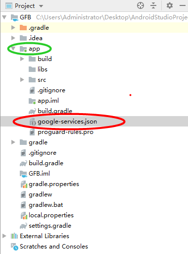

# 2.5 Firebase Analytics数据打点接入配置


若研发方需要使用SDK内部的Google Firebase数据打点功能,请务必完成此小节的配置,否则请直接跳过忽略该小节的配置。

**\(1\)添加Firebase配置文件**

请在Firebase管理后台找到游戏自身对应的Firebase项目然后跳转到Android平台管理界面下载google-services.json文件，若SDK压缩文件夹没有提供该文件，请研发方直接找游戏运营人员获取该文件即可. 然后将该配置文件直接复制到应用的模块（应用级）目录中。如下图所示:



**（2）配置Gradle 文件\(build.gradle\)**

1\) 在根级（项目级）Gradle 文件 \(build.gradle\) 中添加相应规则，以包含 Google 服务插件。如下所示:

```text
buildscript {
  // ...
  dependencies {
    // ...
    classpath 'com.google.gms:google-services:4.3.3'  // Google Services plugin
  }
}
allprojects {
  // ...
  repositories {
    // Check that you have the following line (if not, add it):
    google()  // Google's Maven repository
    // ...
  }
}
```

2\) 在游戏应用模块（应用级）Gradle 文件（通常是 app/build.gradle）中，添加如下两行红色部分。如下所示:

```text
apply plugin: 'com.android.application'
apply plugin: 'com.google.gms.google-services'
googleServices { disableVersionCheck = true }
android {
  // ...
}
```

3\)添加Firebase Analytics的依赖

```text
 implementation 'com.google.firebase:firebase-analytics:18.0.0'
```

